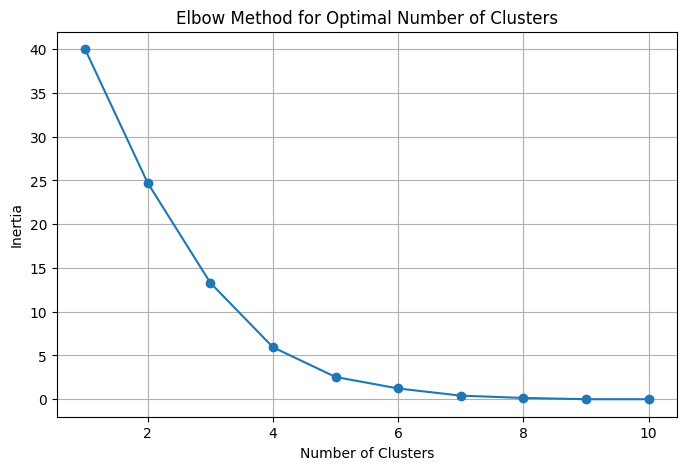

# Customer Segmentation (Python)
Customer segmentation project using Python and K-Means clustering to analyze spending behavior, satisfaction, and loyalty patterns, including data cleaning, clustering, visualization, and business insight generation.

## Project Overview
This project applies **unsupervised machine learning** to segment customers based on behavioral and demographic features.  
The goal is to identify distinct customer groups based on **spending behavior, satisfaction levels, and loyalty status**.

Customer segmentation is widely used in business analytics to support **targeted marketing strategies, customer retention, and product personalization**.

---

## Dataset
The dataset contains customer information from a coffee shop environment, including:

- Age  
- Gender  
- Visit Frequency  
- Weekly Spending  
- Drink Preference  
- Loyalty Membership  
- Satisfaction Score  
- Location  

These variables were used to explore patterns in customer behavior and identify meaningful segments.

---

## Methodology

The analysis follows a typical **data science workflow**:

### 1. Data Preprocessing
- Identification of relevant numerical features  
- Handling of missing values using mean imputation  
- Feature scaling using **StandardScaler**

### 2. Determining Optimal Clusters
Two methods were used to determine the appropriate number of clusters:

- **Elbow Method**
- **Silhouette Score**

Both approaches suggested that **four clusters** provide a suitable segmentation of the dataset.

#### Elbow Method

### 3. K-Means Clustering
A **K-Means clustering model** was trained using the selected features to group customers into distinct segments.

### 4. Cluster Analysis
Cluster characteristics were analyzed by examining average values for:

- Age  
- Weekly Spending  
- Loyalty Membership  
- Satisfaction Score  

This helped identify behavioral patterns across the clusters.

### 5. Visualization
Scatter plot was used to visualize customer clusters:

---

## Key Insights
The clustering analysis revealed several distinct customer segments with different behavioral patterns.

Some clusters showed:

- Higher spending but lower satisfaction  
- Loyal customers with moderate spending  
- Non-loyal customers with lower engagement  

Understanding these patterns can help businesses tailor **marketing strategies and loyalty programs** more effectively.

---

## Technologies Used

- Python  
- pandas  
- scikit-learn  
- matplotlib  
- seaborn  

---

## Future Improvements

Possible next steps include:

- Testing alternative clustering algorithms
- Including additional behavioral features
- Applying the model to a larger dataset
- Building customer profiles for targeted marketing strategies
